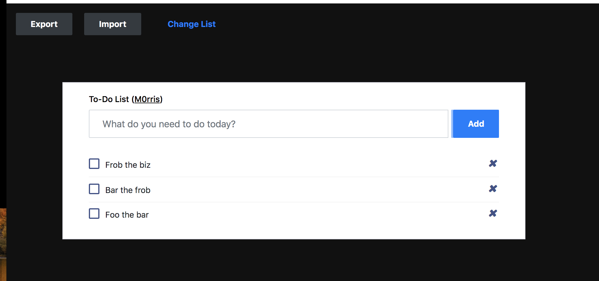
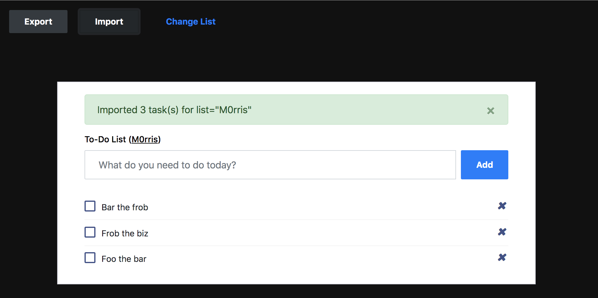
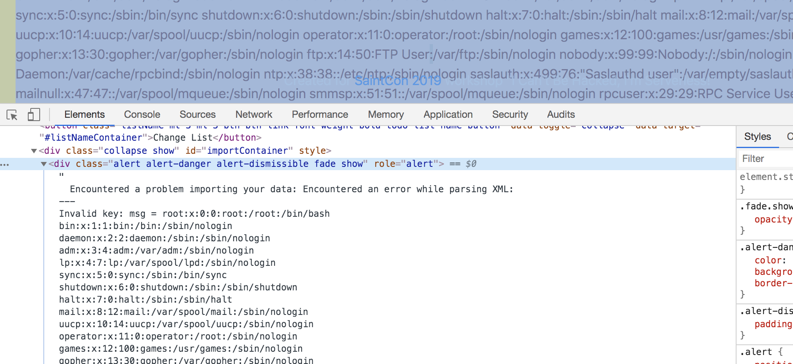

# Lab 2

## Introduction

In the last lab, we discovered that the export function created a backup of our to-do list items and served the backup as an XML document. We also noticed that the backed up data appeared to be validated on the serverside with an HMAC digest.

In this lab, you will find and exploit an XXE vulnerability, and use that to find the HMAC signing key.

## Methodology

Generally speaking, where an application is performing a lot of processing on input data, there is a lot that can go wrong. In the case of this application, the import functionality parses XML and then pickle data, so let's learn a little bit more about

1. What we're able to do
2. What kind of feedback we can get from the application
3. Whether there's an XXE bug in the XML parsing
4. What we can access

## Learning the Import function
We know from [Lab 1](./Lab1.md) that the export function generates an XML document; populate your To-Do list with a few items:



Now export your list, and save the file somewhere on your computer. Finally, delete all the items from your list. It should be completely empty.

Once you've done that, import the file you just exported:



## Discovering level of feedback

Let's see what happens if we change the format of our XML document. Change the `backup` tag to `garbage` and try to import it your file:


So, we get an error and processing stops if we include an invalid tag (i.e. other than `hmac`, `data`, and `backup`).

Interestingly, it seems like the error message includes the content of the invalid tag. Let's test that theory, by changing that outer tag back to `backup` and adding a new element:


Let's see what happens if we exclude some required tags. Delete the `data` and `hmac` elements and import your file. What happened?

## Discovering an XXE bug

From previous work, we know that when an XML document is imported we can include invalid tags and the parser will return an error that include the body of that element. This may be a good candidate for XXE!

In an XML External Entity vulnerability, a vulnerable XML parser is coerced into including a resource from the network or from disk into the XML document. Let's see if we can make that happen here.

Create a malicious payload:

```
<?xml version="1.0" encoding="ISO-8859-1"?>
<!DOCTYPE msg [
  <!ELEMENT msg ANY >
  <!ENTITY data SYSTEM "file:///etc/hostname" >]><msg>&data;</msg>
```
In this payload, `msg` is declared as an element and `data` is declared as a SYSTEM resource. If the XML parser is vulnerable, it will load the `/etc/hostname` file into the `<msg>` element.

Let's upload this payload:


This is promising! Although the file we requested didn't exist, it looks like the parser is configured in a vulnerable way and is trying to load files from disk.

Let's try another file. Modify your XXE payload to read `/etc/hosts`, and upload it. What happened?


A more dramatic file to read would be `/etc/passwd`. See if you can modify the XXE payload to load that file.

A cleaner way to look at the data coming back, since newlines aren't rendered in the DOM, is to look at the HTML in your browser's inspector:



## Finding useful files

At this point, we can use the XXE to read files on disk. Let's see what we can find!

We know that serverless functions live in containers, and secrets are injected into those containers via the environment and the filesystem. Let's see if we can read environments variables via `/proc/self/environ` (upload these XML payloads):

```
<?xml version="1.0" encoding="ISO-8859-1"?>
<!DOCTYPE msg [
  <!ELEMENT msg ANY >
  <!ENTITY data SYSTEM "file:///proc/self/environ" >]><msg>&data;</msg>
```

It looks like we can't read this file directly; the parser appears to be breaking on invalid characters, and since this file contains null-byte-separated environment variables, it is probably breaking on a null-byte.

Let's look for special mounted files:

```
<?xml version="1.0" encoding="ISO-8859-1"?>
<!DOCTYPE msg [
  <!ELEMENT msg ANY >
  <!ENTITY data SYSTEM "file:///proc/mounts" >]><msg>&data;</msg>
```


There are no out-of-the-ordinary files mounted here. Notice the `/var/task` mount, that's where Lambda stores the source code for the serverless application. Let's try to find that, as it may contain useful secrets.

In the [AWS SAM examples](https://github.com/awslabs/serverless-application-model/tree/master/examples/apps/hello-world-python), the code for Python examples is often put in a file called `lambda_function.py`. Let's try searching for that:

```
<?xml version="1.0" encoding="ISO-8859-1"?>
<!DOCTYPE msg [
  <!ELEMENT msg ANY >
  <!ENTITY data SYSTEM "file:///var/task/lambda_function.py" >]><msg>&data;</msg>
```


Using that XXE vulnerability, we're able to disclose the source code of the serverless application:


Scrolling through, you can read the Python code behind every bit of functionality in the application. No more guessing! Do you see anything immediately valuable?

## Recap

By poking around, we were able to determine that including invalid XML elements would cause the web app to spit out the tag and contents of the element. We were able to leverage that to read files from disk in the container via XML external entities (XXE) vulnerability in the XML parser.

Finally, we were able to access the source code for the entire serverless application, which contains a secret!

## Vulnerabilities covered

| Designation | Description | Comment |
| :---: | --- | --- |
| A3:2017 | Sensitive Data Exposure | Sensitive data on disk is leaked via XXE |
| A4:2017 | XML External Entities (XXE) | The import functionality is vulnerable to XXE |
| A6:2017 | Security Misconfiguration | An HMAC key is stored/exposed in the function's source code |
| A9:2017 | Using Components with Known Vulnerabilities | XXE in xml.sax library is mitigated in Python 3.7.1 | 
