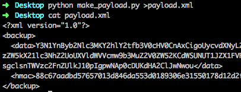
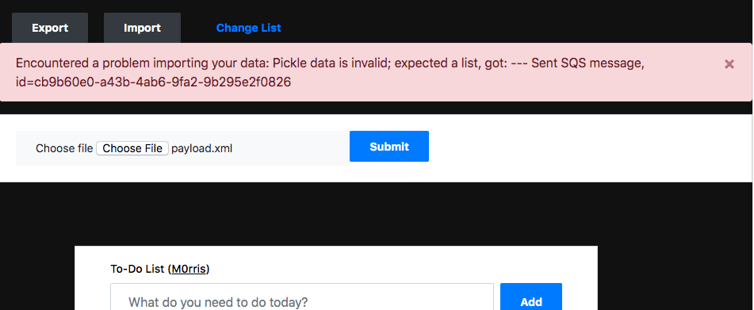

# Lab 4

## Introduction

In the last lab, we used the HMAC key from Lab 2 to sign a malicious pickle payload and get code execution in the serverless environment. We used that access to dump environment variables, and found some useful data. More specifically, we found AWS credentials and an SQS URL.

In this lab, we will explore how to use that SQS URL.

## Methodology

Let's try to find an explanation for the SQS URL in the environment, and interact with the queue if possible. We will

1. Look for clues in the source code we captured in Lab 2
2. Decide the best way to send on the queue
3. Craft a payload
4. Send the payload for glorious victory

## Code Review

If you didn't save a copy of the source code from Lab 2, go back and do that now! ->> [Lab 2](./Lab2.md)

Looking through the code, we can find handlers for the following API calls:
- Add
- List
- Import
- Export
- Delete

All of these handlers have corresponding API calls in the To Do list frontend.

> Don't believe me? Take a minute to look through http://saintcon.hackerapps.cloud/script.js for the various AJAX calls to the API Gateway.

There's one handler that doesn't though: `lambda_handler_hashtagWinning()`. Take a moment to read through the source code for that function, and think about what it is doing.

The comment is pretty telling:
```
Lambda handler for #WINNING operations (do NOT publish this endpoint in the frontend code. FOR ADMIN USE ONLY!!)
```

In this function, a message is sent on an SQS queue with the handle of a winner (whatever that means). We can infer a few things from this:

- The role assigned to the Import function is probably allowed to write to at least this queue
- The queue may be used to invoke another Lambda function
- Submitting your handle to this queue is probably a good thing

## Sending on the queue

We have two options for sending on this queue, and one is objectively better than the other. We're going to need to use the role that we recovered from the environment, so we can either:

1. Put a message onto the queue from your local machine, which requires:
  - Save the credentials into your environment
  - Install AWS CLI or boto3, or some other AWS client
  - Craft and execute your SQS SendMessage payload locally
  - (which results in a log entry against the AWS API from your local machine)
2. Put a message onto the queue from the Lambda container, which requires:
  - Craft and execute your SQS SendMessage payload using the pickle deserialization vuln from Lab3
  - (which results in a totally normal looking log entry)

The rest of this lab will use #2.

By default, the AWS Lambda containers don't have the AWS CLI installed. So, we're going to craft a pickle payload that leverage the Python AWS client, `boto3`, to put a message onto the queue directly from the Import function.

## Crafting a payload

> Extra Credit: Ignore this section and build your own payload!

Update your pickle exploit from Lab 3, to execute the following command:

```
/usr/bin/python -c "import boto3, os, json; client = boto3.client('sqs'); r = client.send_message(QueueUrl=os.getenv('VICTORY_QUEUE_URL'), MessageBody=json.dumps({'handle': 'REPLACEME_WITH_YOUR_HANDLE_FOR GLORIOUS_VICTORY'})); print('Sent SQS message, id=' + r['MessageId'])"
```

Let's walk through what this does.

- `python -c`: Execute the following string as a Python script
- `client = boto3.client('sqs')`: Create an SQS client
- `os.getenv('VICTORY_QUEUE_URL')`: Get the SQS queue URL from the environment
- `send_message`: Send your handle over the queue (make sure you put your handle in there)
- `print`: Send some evidence back to the browser that the message was sent

With your pickle generator script updated, build the XML file:



## Import your payload

Finally, upload your XML payload to the web app via the Import functionality. It should take a few seconds before you see the result:



Verify with me that your handle hit the queue!

## Recap

We discovered by looking through the handler code that a follow-on action is performed when sending a request to an unknown administrative API Gateway endpoint. You bypassed that restriction by sending your handle directly to the SQS queue, which in real life likely would have triggered another Lambda function that designates you a "winner".

We coerced the Import function to do that for us, working smarter, not harder!

## Vulnerabilities covered

| Designation | Description | Comment |
| :---: | --- | --- |
| A1:2017 | Injection | Able to access an undocumented workflow by injecting messages directly into an SQS queue |
| A10:2017 | Insufficient Logging/Monitoring | API calls executed in the container via pickle deserialization exploit are indistinguishable from normal operation |
